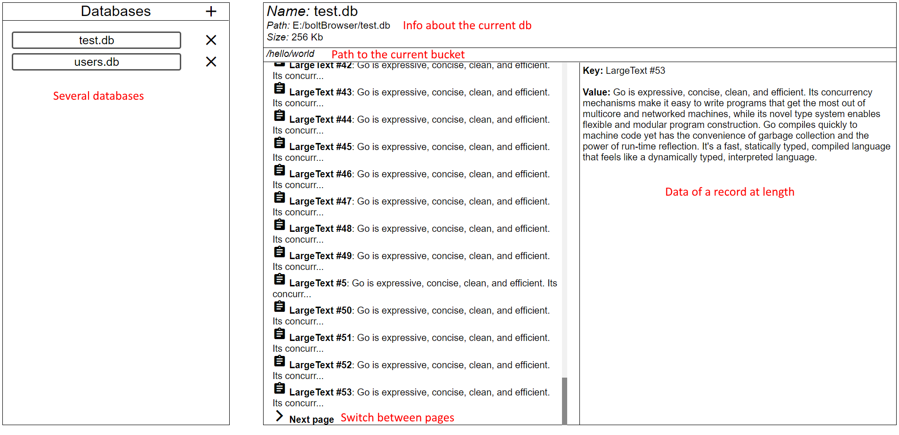

# boltBrowser

[](https://github.com/ShoshinNikita/boltBrowser/graphs/commit-activity)
[](https://goreportcard.com/report/github.com/ShoshinNikita/boltBrowser)
[](https://coveralls.io/github/ShoshinNikita/boltBrowser?branch=master)
[](https://github.com/ShoshinNikita/boltBrowser)
[](https://github.com/ShoshinNikita/boltBrowser/releases)

boltBrowser is a web-based explorer for BoltDB.

**Warning!** I need your help. For details see [help wanted](#help-wanted)

## Features

+ You can work with several databases in one time
+ You can visit nested buckets
+ Minimalistic and simple interface
+ Opportunity to search records and buckets using regex
+ Opportunity to edit a db (create, delete, modify buckets and records)

[Examples of using the program](Examples.md)



## How to start

1. Run the program (you can download the latest release [here](https://github.com/ShoshinNikita/boltBrowser/releases))
1. Go to [localhost:500](http://localhost:500)
1. Open the list of databases
1. Add a database by pressing sign '+'
1. Enjoy!

## Settings

Setting | Default value | Description
---- | ---- | ----
`port` | `:500` | port of the website
`offset` | `100` | number of records on a single page
`debug` | `false` | mode of debugging
`check version` | `true` | should program check a new version
`open browser` | `true` | should the program open a browser automatically
`neat window` | `true` | should the program open a neat window

You can change settings by editing a config file or using command line flags.

### Config file

The config file – `config.ini`. The default content:

```ini
# List of all opts:
# port
# debug
# offset
# should_check_version
# is_write_mode
# open_browser
# open_neat_window

# Port for website
port=:500
debug=false
# number of records on a single screen
offset=100
should_check_version=true
is_write_mode=true
open_browser=true
# has effect only if 'open browser' is true
open_neat_window=true
```

You can overwrite values from the config file by setting flags.

### Flags

The default values are the same as values in the config file.

Flag  | Description
----  | ----
`-port` | port of the website
`-offset` | number of records on single page
`-debug` | mode of debugging
`-checkVer` | should program check a new version
`-openBrowser` | should the program open a browser automatically
`-neatWindow` | should the program open a neat window

### Security

Program use function `EscapeString()` from `package html` for preventing of js-injection.

### Other

You can change mode of converting `[]byte`. Just change functions `ConvertKey(b []byte) string` (or `ConvertValue()`) in [src/converters/converter.go](src/converters/converters.go)

__Note__: function will be used for converting all keys (or values). So, if your keys (or values) were converted from either `string` or `uint` program will crash.

## Additional info

Initial work was undertaken on [Bitbucket](https://bitbucket.org/ShoshinNikita/boltbrowser).

## Help wanted

Unfortunately, I'm not a good frontend and UI developer. So, it would be great, if you decide to help me.

If you want to help, you can check [Issues](https://github.com/ShoshinNikita/boltBrowser/issues) or you can skim through the source code.

## License

[MIT License](LICENSE)